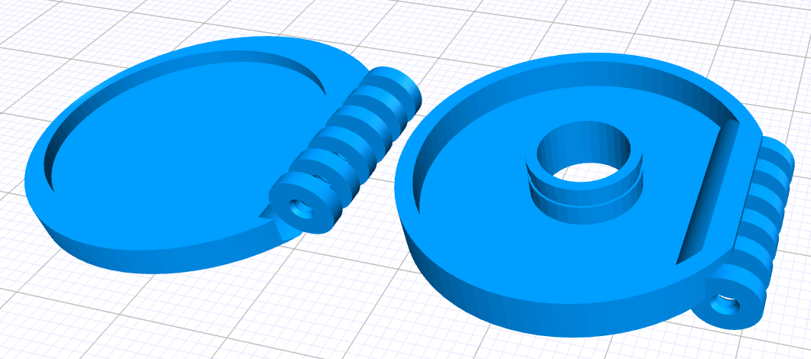

# theodolite-mirror
Wild T2 theodolite mirror support

by guexel@gmail.com Gustavo Exel

2025-06-14 first version

mirror holder for Wild T2 theodolites;
3d model suitable for a 3d printer;
should be run on jscad then exported to a 3d printable format such as .stl;
you'll need a 1"=25.4mm round mirror, which you can find on temu.com

made for https://github.com/jscad/;
should work on openjscad.xyz and jscad.app;
doesn't work on neorama.de/openjscad.org which apparently uses an old version of JSCad

